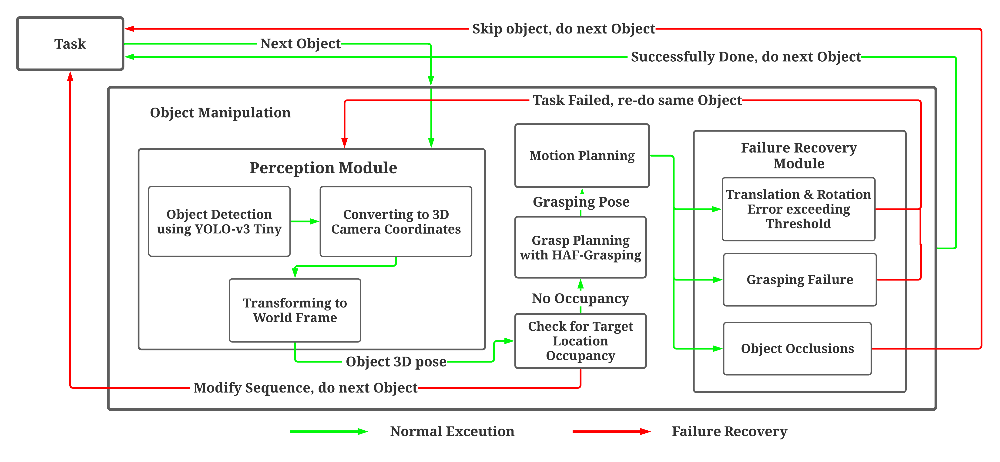

# OCRTOC_Challenge
Contains all codes for our submission to [http://www.ocrtoc.org/#/](Open Cloud Robotics Table Organization Challenge) 2020.

The respository consists of the entire ROS workspace to perform the task along with the data points, python based annotator and the annotations to train the YOLO v3 Tiny object detector.

## Pipeine

<!-- ## Folder Structure
<ol>
	<li><b>YOLO</b> - Contains manually collected and annotated data points to train YOLO object detector. This folder also stores the python based annotator as well.</li>
	<li><b>orctoc_ws</b> - This folder contains the entire ROS workspace for the challenge</li> -->